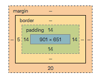

[!Link to page](https://liloumazzarisi.github.io/progressive-enhancement/)

# 1. HTML is about semantics
**What is "semantics" ?**
Semantics marks up what a series of information is to be considered as. 
- adds hierarchy and
- structures a text
*= That's what HTML is for!*

To make proper HTML code, one must think about the structure of its text. 

### Why is semantics so important ?

1 - SEO : your website's findability / visibility on Google
2 - Accessibility : all humans, no matter their handicap have to access the information.

**Semantic is actually pretty easy** 

Semantics =  choosing the right tags and attributes to represent your content. 
GOLDEN RULE -> as little code as possible, but as much as necessary.

**Tags**
Tags are used to indicate the semantic function of a portion of content in "blocks". Most html blocks work with an opening tag and a closing tag.

*Syntax example :*

```html    
<p>This is a paragraph (hence the P letter).</p>
```
| Tags       | Description                                                                                                                                                                               |
| ---------- | ----------------------------------------------------------------------------------------------------------------------------------------------------------------------------------------- |
| h1         | Heading                                                                                                                                                                                   |
| h2         | Subheading                                                                                                                                                                                |
| section    | section is a thematic grouping of content. A general rule is that the section element is appropriate only if the element’s contents would be listed explicitly in the document’s outline. |
| blockquote | represents a section that is quoted from another source.                                                                                                                                  |
| q          | phrasing content quoted from another source.                                                                                                                                              |
| img        | picture                                                                                                                                                                                   |
| p          | paragraph                                                                                                                                                                                 |
| figure     | The figure element represents some flow content. Typically referenced as a single unit from the main flow of the document.                                                                |
| caption    | the title of the table that is its parent, if it has a parent and that is a table element.                                                                                                |
| table      | The table element represents data with more than one dimension, in the form of a table. Tables must not be used as layout aids.                                                           |
| th         | table head = name/category of the row or column                                                                                                                                           |
| tr         | table row                                                                                                                                                                                 |
| td         | table data = content in the table                                                                                                                                                         |
| ul         | unordered list with dots                                                                                                                                                                  |
| ol         | orderd list with #                                                                                                                                                                        |
| li         | list item                                                                                                                                                                                 |
!! **div** or **span** : they do not provide any semantics.

**Attributes** 
They are used to define the characteristics of the tags : they help describe the tags and its content in order to clarify the nature of it.

 *Here is a one-line summary of the syntax of tags, attributes and values:*

```html
<tag attribute="value">content</tag>
```

# 2. CSS is to improve the visual look

CSS (Cascading Style Sheet) is a computer language that allows you to control the visual aspect of your content. 

For example: 
| properties  | Description                                                                 |
| ----------- | --------------------------------------------------------------------------- |
| font-style  | sets whether a font should be styled with a normal, italic, or oblique face |
| font-size   | sets the size of teh selected text                                          |
| color       | sets the color of the selected text                                         |
| line-height | sets the height of a line box                                               |

Syntax

```css
selector {
  property: value;
  property: value;
  /* This is a comment */
  property: value;
  ...;
}
```
**!! IMPORTANT**

* Each line must end with a `;`
* You can declare as many properties as you want. You can even declare the same property twice. In this case, the last one will be taken into account (->  "cascading").
* the stylized element is called "the selector". It is followed by a block containing one or more properties, enclosed in braces `{}`

For the browser to take it into account, your CSS it must be linked to the HTML File :
```html 
<link rel="stylesheet" href="style.css">
```
### Concept 1: CSS selectors
CSS selectors allow you to select in your html the content to be stylized via the tag containing it.

#### A. The most important ones
The elements to be stylized are selected via the attribute 
* `class` (.name-of-class) 
* `id` (#name-of-lid)

#### B. Select using parents and children elements

`>` : selects the child element 

Example: 
```css
div > p { 
  color : blue; 
}
```
*-> this will select the p children from div and color the text blue.* 

#### C. All other selectors
+ and >
Select via the attribute `[attribute]`

| Selector             | Example                | Example description                                                                                      |
| -------------------- | ---------------------- | -------------------------------------------------------------------------------------------------------- |
| .class               | .intro                 | Selects all elements with class="intro"                                                                  |
| .class1.class2       | .name1.name2           | Selects all elements with both name1 and name2 set within its class attribute                            |
| .class1 .class2      | .name1 .name2          | Selects all elements with name2 that is a descendant of an element with name1                            |
| #id                  | #firstname             | Selects the element with id="firstname"                                                                  |
| *                    | *                      | Selects all elements                                                                                     |
| element              | p                      | Selects all `<p>` elements                                                                               |
| element.class        | p.intro                | Selects all `<p>` elements with class="intro"                                                            |
| element,element      | div, p                 | Selects all `<div>` elements and all `<p>` elements                                                      |
| element element      | div p                  | Selects all `<p>` elements inside `<div>` elements                                                       |
| element>element      | div >p                 | Selects all `<p>` elements where the parent is a `<div>` element                                         |
| element+element      | div + p                | Selects the first `<p>` element that is placed immediately after `<div>` elements                        |
| element1~element2    | p ~ ul                 | Selects every `<ul>` element that is preceded by a `<p>` element                                         |
| `[attribute]`        | `[target]`             | Selects all elements with a target attribute                                                             |
| `[attribute=value]`  | `[target=_blank]`      | Selects all elements with target="_blank"                                                                |
| `[attribute~=value]` | `[title~=flower]`      | Selects all elements with a title attribute containing the word "flower"                                 |
| `[attribute          | =value]`               | `[lang                                                                                                   | =en]` | Selects all elements with a lang attribute value equal to "en" or starting with "en-" |
| `[attribute^=value]` | `a[href^="https"]`     | Selects every `<a>` element whose href attribute value begins with "https"                               |
| `[attribute$=value]` | `a[href$=".pdf"]`      | Selects every `<a>` element whose href attribute value ends with ".pdf"                                  |
| `[attribute*=value]` | `a[href*="w3schools"]` | Selects every `<a>` element whose href attribute value contains the substring "w3schools"                |
| :active              | a:active               | Selects the active link                                                                                  |
| ::after              | p::after               | Insert something after the content of each `<p>` element                                                 |
| ::before             | p::before              | Insert something before the content of each `<p>` element                                                |
| :checked             | input:checked          | Selects every checked `<input>` element                                                                  |
| :default             | input:default          | Selects the default `<input>` element                                                                    |
| :disabled            | input:disabled         | Selects every disabled `<input>` element                                                                 |
| :empty               | p:empty                | Selects every `<p>` element that has no children (including text nodes)                                  |
| :enabled             | input:enabled          | Selects every enabled `<input>` element                                                                  |
| :first-child         | p:first-child          | Selects every `<p>` element that is the first child of its parent                                        |
| ::first-letter       | p::first-letter        | Selects the first letter of every `<p>` element                                                          |
| ::first-line         | p::first-line          | Selects the first line of every `<p>` element                                                            |
| :first-of-type       | p:first-of-type        | Selects every `<p>` element that is the first `<p>` element of its parent                                |
| :focus               | input:focus            | Selects the input element which has focus                                                                |
| :fullscreen          | :fullscreen            | Selects the element that is in full-screen mode                                                          |
| :hover               | a:hover                | Selects links on mouse over                                                                              |
| :in-range            | input:in-range         | Selects input elements with a value within a specified range                                             |
| :indeterminate       | input:indeterminate    | Selects input elements that are in an indeterminate state                                                |
| :invalid             | input:invalid          | Selects all input elements with an invalid value                                                         |
| :lang(language)      | p:lang(it)             | Selects every `<p>` element with a lang attribute equal to "it" (Italian)                                |
| :last-child          | p:last-child           | Selects every `<p>` element that is the last child of its parent                                         |
| :last-of-type        | p:last-of-type         | Selects every `<p>` element that is the last `<p>` element of its parent                                 |
| :link                | a:link                 | Selects all unvisited links                                                                              |
| ::marker             | ::marker               | Selects the markers of list items                                                                        |
| :not(selector)       | :not(p)                | Selects every element that is not a `<p>` element                                                        |
| :nth-child(n)        | p:nth-child(2)         | Selects every `<p>` element that is the second child of its parent                                       |
| :nth-last-child(n)   | p:nth-last-child(2)    | Selects every `<p>` element that is the second child of its parent, counting from the last child         |
| :nth-last-of-type(n) | p:nth-last-of-type(2)  | Selects every `<p>` element that is the second `<p>` element of its parent, counting from the last child |
| :nth-of-type(n)      | p:nth-of-type(2)       | Selects every `<p>` element that is the second `<p>` element of its parent                               |
| :only-of-type        | p:only-of-type         | Selects every `<p>` element that is the only `<p>` element of its parent                                 |
| :only-child          | p:only-child           | Selects every `<p>` element that is the only child of its parent                                         |
| :optional            | input:optional         | Selects input elements with no "required" attribute                                                      |
| :out-of-range        | input:out-of-range     | Selects input elements with a value outside a specified range                                            |
| ::placeholder        | input::placeholder     | Selects input elements with the "placeholder" attribute specified                                        |
| :read-only           | input:read-only        | Selects input elements with the "readonly" attribute specified                                           |
| :read-write          | input:read-write       | Selects input elements with the "readonly" attribute NOT specified                                       |
| :required            | input:required         | Selects input elements with the "required" attribute specified                                           |
| :root                | :root                  | Selects the document's root element                                                                      |
| ::selection          | ::selection            | Selects the portion of an element that is selected by a user                                             |
| :target              | #news:targe            | Selects the current active #news element (clicked on a URL containing that anchor name)                  |
| :valid               | input:valid            | Selects all input elements with a valid value                                                            |
| :visited             | a:visited              | Selects all visited links                                                                                |

### Concept 2: block model
All tags are rendered visually as a "block". This is called the box model. Each block includes margin, padding border properties.

 

You can control the dimensions and spacing of this block:

* width/ height : width and height dimensions
* Border: controls the border. For example: border:1px solid #FF0000; creates an edge made of a solid red line #FF0000 and 1px thick
* padding: the space between the content of the block and its outline (the border). The padding "inflates" the block.
* Margin: the space around the block, outside it. The margin distances the block from its surroundings. You should know that these sometimes collapse but for now you don't have to worry too much about it, just know it exists.

### Concept 3: CSS positioning

CSS allows you to define the visual positioning of the elements. It is probably the richest and therefore the most complex system, because the ways of controlling positioning has had a rather complicated history. It was long ago necessary to use hacks. Things are more stable now, especially if you don't have to support users stuck on internet explorer 9.... But let's start over from the beginning.

Understanding the Browser Rendering flow
Each html block has a "display" property which is either: display: inline | inline-block | block and is displayed according to its order of appearance in the html file. This is called the natural positioning flow or more simply the flow.

 
If you add a float: left | right; it will take whatever you applied it to outside of the normal rendering flow and put it as far left or right as possible, but respecting the margin.
 

**Breaking the flow**
The flow is the default behavior. You may need an element to exit the position flow.

position : static | relative | absolute | fixed ;

The position property allows you to position an element anywhere (via the top and left properties), from the coordinates of its first parent in position: relative or static.

**Reset CSS**

Les navigateurs n'utilisent pas toujours les mêmes marges et padding par défaut pour les différents éléments HTML. Cela peut représenter un problème, par exemple lorsqu'on veut supprimer le retrait à gauche d'une liste avec un margin-left: 0; et que certains navigateurs conservent ce retrait car ils utilisent un padding plutôt qu'une marge. Ajoutez quelques différences de ce type entre les styles par défaut des navigateurs, et la solution qui semble s'imposer est la suivante: supprimer toutes les marges et retraits internes des éléments.

```css
* {
    margin: 0;
    padding: 0;
}
```